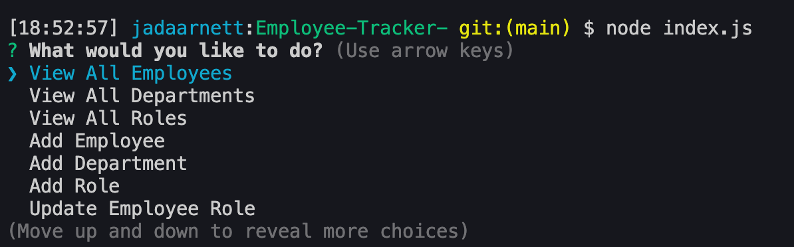

# Employee-Tracker

Welcome to my Employee Tracker Application. It is a CMS that allows you to organize a company's employees! The user can view and add all employees, departments and roles. The user can also update employee roles. This application is great for busy business managers that are looking to keep track of all of their employees. 

[Video Walkthrough of Application](https://drive.google.com/file/d/1Crlecguqc1uD4X_yiLDn6SHFXytXeGCs/view)

## Installation
Navigate to the correct directory and run 'npm install' to install the applications necessary dependencies. 

## Usage 
This application can be used by navigating to the proper directory and initializing with 'node index.js'.
Once the app is initialized, you will see these options:

Navigate through the menu to add, view, roles and departments and update employees. 

## License 
MIT

## Contributing
If interested in contributing, please reach out to me directly via an email at jada.arnett@gmail.com. 
